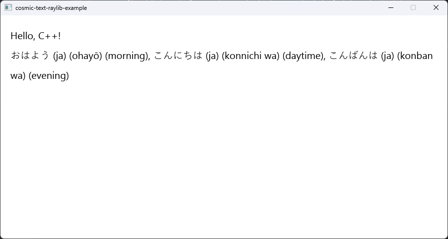

# cosmic-text-cpp (WIP)



## Build Instructions
### Build the system library
```shell
cargo build
```

### Move the system library to the lib folder
```shell
mv target/debug/cosmic_text_c.lib lib/cosmic_text_c.lib
```

### Generate the header

C++
```shell
cbindgen --config cppbindgen.toml --crate cosmic-text-c --output include/cosmic-text.hpp
```

C
```shell
cbindgen --config cbindgen.toml --crate cosmic-text-c --output include/cosmic-text.h
```

## User Instructions
Look in the examples folder for how to use this in your C++ project.